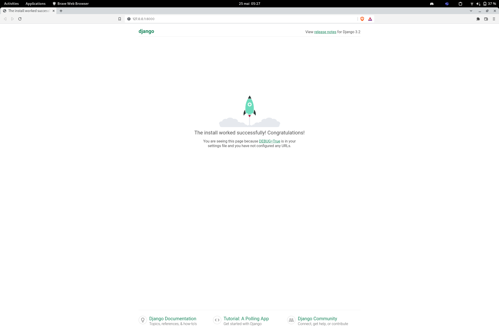

# -Workshop-Initiation-au-Framework-Django

        lien de la doc : https://docs.djangoproject.com/en/4.0/

## Instalation :grey_exclamation:
  - 1.1 Django
    - 1.1.0 Pour tester la version (pyhthon -m django --version)
  - 2.1 psycopg2
  - 3.1 PostgreSQL
    - 3.1.0 ouvrir la console de postgre et crée une base de données

## Step 00 Lancement du projet Django :grey_exclamation:
  - 1.1 Avec la commande django-admin startproject Workshop 
        vous allez créé votre projet Django
  - 1.2 faire les migrations
  - 1.3 Une fois les migrations faite lançait le serveur 
  

     
  
   
   
  

## Step 01 Premiere appli et Url :grey_exclamation:
  - 1.1 installer et include Django Debug Toolbar
      dans votre serveur (https://django-debug-toolbar.readthedocs.io/en/latest/) **n'oublier pas d'inclure les url (lire la doc)
  - 1.1 Après avoir Installe une aplicaton de l'extérieur cree la vôtre de la même façon (nommer la "store")

## Step 02 Premiere vue et models :grey_exclamation:
  - 1.1 cree un dossier templates dans le repertoire de l'aplication, un sous dosier a son nom ainsi qu'un fichier urls.py
  - 1.2 rajouter les URL de l'application dans le fichier URL de notre serveur 
  Voici un bout de code a copié coller et a mis dans le fichier views py
  (ping le gérant du workshop pour qu'il vous donne le code ;))

        

